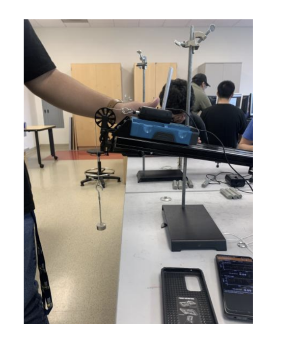

# Welcome to Hensser's Page!

## About me
I am a student attending UC Merced. I am a second year in Electrical Engineering. 

## Fun facts
1. I have 10,000 trophies in Clash Royale
2. I like rainbows
3. I have a guitar and I dream of becoming a rockstar
4. I support Real Madrid: Hala Madrid!

## Courses that I am currently taking

1. EE 021: Intro to EE Programming: [Here](https://ee-ucmerced.github.io/ee021/) is my midterm project.
2. Phys 009: Electricty and Magnetism

